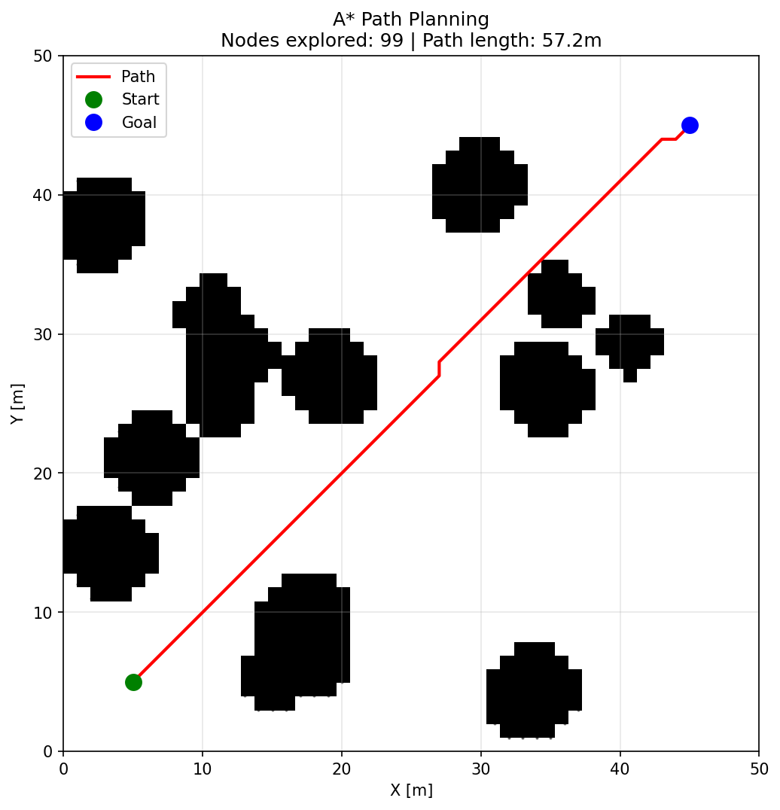
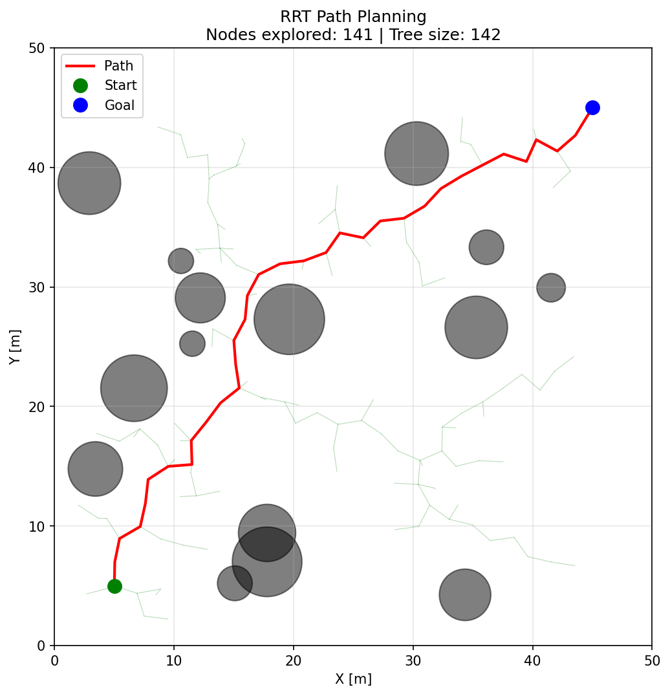
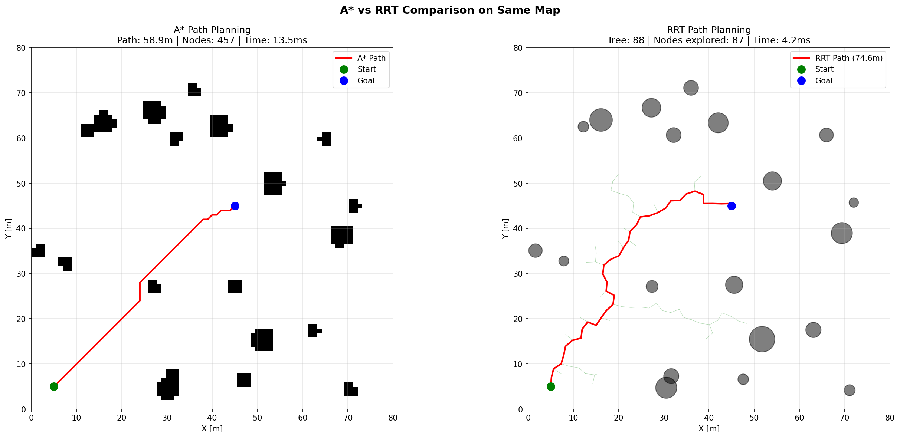
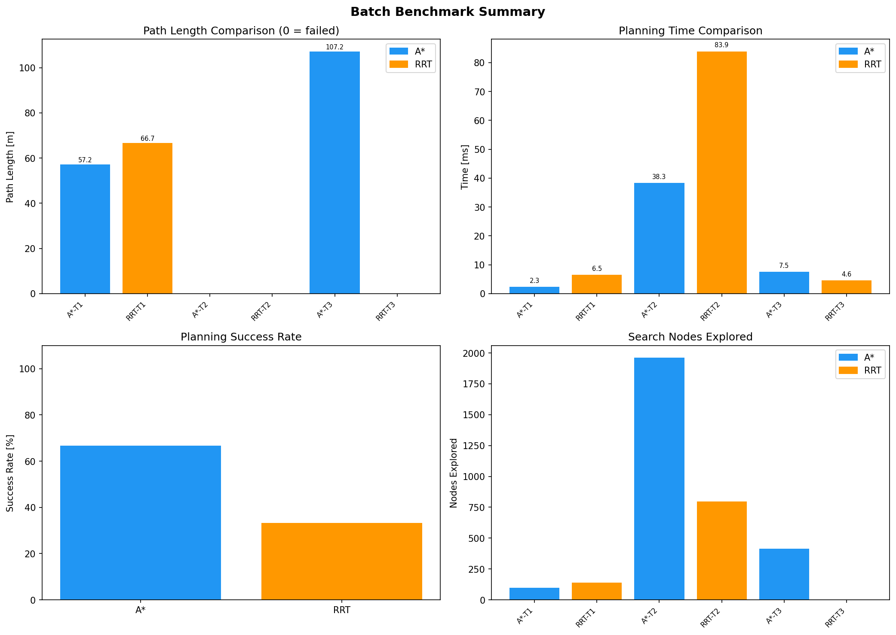

# 基於 A* 與 RRT 的移動機器人路徑規劃仿真系統

基於 Python 實現的移動機器人路徑規劃仿真系統，實現了 **A\***（柵格最優搜索）和 **RRT**（採樣規劃）兩種經典算法，包含可視化、批量測試和 CSV 結果導出。

## 1. 項目簡介

本項目模擬二維移動機器人路徑規劃，提供：

- 可配置的二維柵格地圖環境，支持隨機障礙物生成
- 兩種經典路徑規劃算法：A\* 和 RRT
- 同一地圖下的算法對比可視化
- 多場景批量自動化測試
- 定量化指標評估與 CSV 導出

本項目算法思路參考了 [PythonRobotics](https://github.com/AtsushiSakai/PythonRobotics)，但重新設計了模塊化架構，並加入了批量測試、指標評估、對比可視化等工程化功能，適合作為機器人算法學習與簡歷項目展示。

## 2. 功能特性

- 二維柵格地圖仿真，支持自定義大小與分辨率
- 隨機圓形障礙物生成（可配置數量、大小、隨機種子）
- **A\*** 路徑規劃：8方向運動模型 + 歐幾里得啟發式
- **RRT** 路徑規劃：目標偏向採樣 + 步長控制 + 連續空間碰撞檢測
- 碰撞檢測（A\*: 柵格佔用 / RRT: 圓形障礙物距離）
- Matplotlib 可視化（路徑、搜索樹、障礙物）
- **A\* vs RRT 左右對比圖**
- **批量測試**：多地圖規模、多障礙物密度
- **CSV 結果導出** + 統計摘要
- **CLI 命令行接口**，所有參數可通過 argparse 控制

## 3. 技術棧

Python 3.8+ | NumPy | Matplotlib | A\* | RRT | 路徑規劃 | 碰撞檢測

## 4. 項目結構

```
path_planning_simulator/
├── algorithms/
│   ├── astar.py              # A* 柵格搜索規劃器
│   ├── rrt.py                # RRT 採樣規劃器
│   └── collision.py          # 碰撞檢測工具
├── maps/
│   ├── grid_map.py           # 二維佔用柵格地圖
│   └── obstacle_generator.py # 障礙物生成（隨機、牆壁、房間）
├── evaluation/
│   ├── metrics.py            # 路徑指標（長度、平滑度、安全距離）
│   └── batch_test.py         # 批量測試 + CSV 導出
├── visualization/
│   └── plotter.py            # Matplotlib 繪圖（單圖 + 對比圖 + 統計圖）
├── outputs/
│   ├── figures/              # 生成的演示圖片
│   └── results/              # CSV 與 benchmark 摘要
├── assets/                   # README 展示用靜態圖片
├── docs/                     # 項目文檔
├── main.py                   # CLI 主入口
├── requirements.txt
├── .gitignore
├── LICENSE
├── NOTICE
└── README.md
```

## 5. 安裝與環境配置

```powershell
# Clone 倉庫
git clone https://github.com/<your-github-username>/path_planning_simulator.git
cd path_planning_simulator

# 建立虛擬環境（Windows PowerShell）
python -m venv .venv
.\.venv\Scripts\Activate.ps1

# 如果遇到執行策略問題，先執行：
# Set-ExecutionPolicy -ExecutionPolicy RemoteSigned -Scope CurrentUser

# 安裝依賴
pip install -r requirements.txt
```

**依賴說明**：僅需 `numpy` 和 `matplotlib`，無重型框架。

## 6. 快速開始

```powershell
# 運行 A* 演示（保存圖片到 outputs/figures/）
python main.py --algo astar --no-show

# 運行 RRT 演示
python main.py --algo rrt --no-show

# 同時運行兩種算法 + 生成對比圖
python main.py --algo both --map-size 80 --num-obstacles 20 --seed 123 --no-show

# 批量測試（3 組場景，生成 CSV + 統計圖）
python main.py --batch

# 交互模式（彈出 Matplotlib 窗口）
python main.py --algo both
```

### CLI 參數說明

| 參數 | 可選值 | 默認值 | 說明 |
|------|--------|--------|------|
| `--algo` | `astar`, `rrt`, `both` | `both` | 運行的算法 |
| `--map` | `random`, `room` | `random` | 地圖類型 |
| `--map-size` | int | `50` | 地圖大小（米） |
| `--resolution` | float | `1.0` | A\* 柵格分辨率（米） |
| `--num-obstacles` | int | `15` | 隨機障礙物數量 |
| `--robot-radius` | float | `0.5` | 機器人半徑（米） |
| `--start-x/y`、`--goal-x/y` | float | `5,5 → 45,45` | 起點/終點坐標 |
| `--seed` | int | `42` | 隨機種子（保證可複現） |
| `--no-show` | flag | off | 不彈窗顯示，保存圖片 |
| `--batch` | flag | off | 運行批量測試並導出 CSV |

## 7. 演示結果

### A* 路徑規劃


### RRT 路徑規劃


### A* vs RRT 對比


### 批量測試統計


## 8. 算法簡介

### A\*
- **類型**：基於柵格的啟發式搜索
- **公式**：f(n) = g(n) + h(n)，h(n) 為歐幾里得距離
- **運動模型**：8方向（4個正交 + 4個對角線）
- **最優性**：保證找到最短路徑（啟發式可採納時）
- **地圖形式**：離散佔用柵格

### RRT
- **類型**：基於採樣的規劃
- **流程**：隨機採樣 → 最近節點 → 步長擴展 → 碰撞檢測 → 加入樹
- **特點**：目標偏向（5%）、固定步長、路徑插值
- **最優性**：概率完備，但路徑非最優
- **地圖形式**：連續空間 + 圓形障礙物

詳細算法說明見 [docs/ALGORITHM_EXPLANATION.md](docs/ALGORITHM_EXPLANATION.md)。

## 9. 批量測試結果

測試結果位於 `outputs/results/`：
- **batch_results.csv**：每項測試的詳細指標
- **benchmark_summary.md**：可讀的對比摘要

| 指標 | A\* | RRT |
|------|-----|-----|
| 成功率 | 2/3 (67%) | 1/3 (33%) |
| 平均路徑長度（成功時） | 82.2 m | 66.7 m |
| 平均運行時間 | 15.8 ms | 36.0 ms |
| 平均搜索節點數 | 825 | 312 |

## 10. 簡歷描述

> 基於 Python 構建二維柵格地圖仿真環境，實現障礙物生成、起終點設置與路徑可視化。實現 A\* 與 RRT 路徑規劃算法，完成最短路徑搜索、隨機樹擴展、步長控制與碰撞檢測。設計批量測試流程，對不同地圖規模和障礙物密度下的路徑長度、運行時間、節點數及成功率進行評估。

更多版本見 [docs/RESUME_DESCRIPTION.md](docs/RESUME_DESCRIPTION.md)。

## 11. 後續改進方向

- [ ] **RRT\*** — 漸進最優 RRT 變體
- [ ] **Informed RRT\*** — 橢圓採樣加速收斂
- [ ] **路徑平滑** — B-spline 或貝塞爾曲線後處理
- [ ] **動態障礙物** — 移動障礙物 + 重規劃
- [ ] **GUI** — 交互式起終點設置
- [ ] **更多指標** — 路徑曲率、能耗估算
- [ ] **ROS2 集成** — 發布 `nav_msgs/Path`
- [ ] **三維擴展** — 無人機路徑規劃

## 12. 項目文檔

- [項目報告（中文）](docs/PROJECT_REPORT.md)
- [算法詳解](docs/ALGORITHM_EXPLANATION.md)
- [面試講解稿（中文）](docs/INTERVIEW_NOTES.md)
- [簡歷描述](docs/RESUME_DESCRIPTION.md)
- [運行審計日誌](docs/RUN_AUDIT.md)
- [GitHub 上傳清單](docs/GITHUB_CHECKLIST.md)

## 13. 致謝

本項目算法思路與可視化設計參考了 [PythonRobotics](https://github.com/AtsushiSakai/PythonRobotics)（MIT License, Copyright (c) 2016 Atsushi Sakai）。

與 PythonRobotics 的主要區別：
- 模塊化架構（algorithms / maps / evaluation / visualization 分層）
- 批量測試框架與定量化指標
- CSV 導出與 Benchmark 摘要
- A\* vs RRT 左右對比可視化
- 重新組織為獨立的 GitHub 項目

詳見 [NOTICE](NOTICE)。

## 14. 開源協議

MIT License — 詳見 [LICENSE](LICENSE)。
